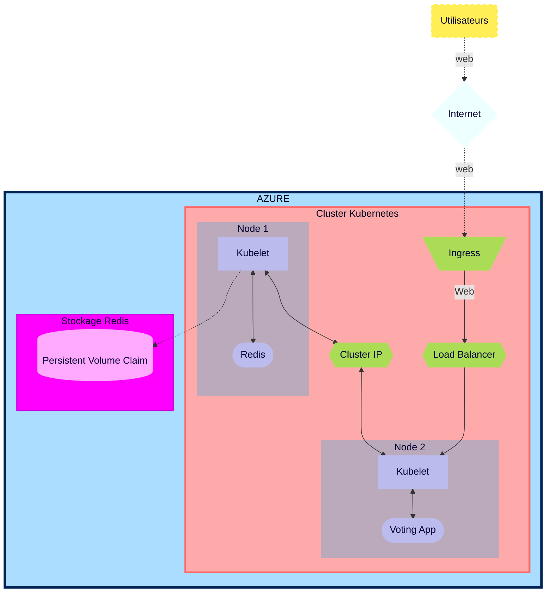

# Action Plan - *Brief 6*

<div id='home'/>  

## Summary
#### [00 - Daily Scrum](#Scrum)
#### [01 - K8s & AKS (powershell, Azure Cli & Bash) doc reading](#Doc)
#### [02 - Architecture Topology](#Topology)
#### [03 - Resource List](#Resources)
#### [04 - AKS cluster deployment with 2 nodes](#ClusterAKS)
#### [05 - Redis & Vote App Deployment](#Redis)
#### [06 - Load Balancer Deployment](#LB)
#### [07 - ClusterIP application for Redis](#ClusterIP)
#### [08 - Redis password setting](#MDP)
#### [09 - Creation of Kubenetes secret](#Secret)
#### [10 - Creation of Azure Storage Account](#Stockage)
#### [11 - Setting of Persistent Volume & P.V.Claim](#PVC)
#### [12 - Creation of Ingress Controller with Kubernetes Nginx](#Ingress)
#### [13 - Creation of DNS registering on Gandi](#Gandi)
#### [14 - Creation of TLS certificate with Cert-Manager for Voting App](#certificat)
#### [15 - Horizontal Auto-scaling of Voting App](#Auto-scaling)
#### [16 - Load testing](#Charge)
#### [17 - Executive summary + Kubernetes functionnality](#Summary)
#### [18 - Technical Architecture Document of deployed infrastructure](#TAD)


<div id='Scrum'/>

# Plan d'action

### **Daily Scrum**
Daily personnal reactions with reports and designations of first tasks for the day.

Frequent meeting with other coworkers to study solutions to encountered problems together.

[scrums](https://github.com/Simplon-Luna/b6_Luna/blob/main/Scrum.md)

[&#8679;](#home)

<div id='Doc'/>

### **K8s & AKS (powershell, Azure Cli & Bash) doc reading**
Reading of documentations to determine the functionnalitiez, prerequisites and different tools required to accomplish Brief 6.

[&#8679;](#home)

<div id='Topologie'/>

### **Infrastructure Topology**
Planified Architecture

*Schematic is made for the most generalize case where the pods aren't in the same node.*
*Pods are schematized by a single item even if they can represent multiple replicas.*



[&#8679;](#home)

<div id='Resources'/>

### **Resources List**

-----------
| Ressources | Cluster AKS | Redis |  Voting App |
| :--------: | :--------: | :--------: | :--------: |
| Azure service | ✓ | ✓ | ✓ |
| resource groupe | ✓ |✓ | ✓ |
| SSH (port) | N/A | 6379 | 80 |
| CPU limit | N/A | 100m-250m | 100m-250m |
| Mémoire limit | N/A | 128mi-256mi | 128mi-256mi |
| Image | N/A | redis:latest  | whujin11e/public:azure_voting_app |
| Load Balancer | N/A | ✓ puis ✗ | ✓ |
| ClusterIP | N/A | ✗ puis ✓ | ✗ |
| Kebernetes secret | ✓ | ✓ | ✓ |
| Storage secret | ✓ | ✓ | ✓ |
| Storage account (Standard LRS) | N/A | ✓ | ✓ |
| Persistent Volume | N/A | ✓ | ✗ |
| Persistent Vol. Claim (3Gi) | N/A | ✓ | ✗ |
| Ingress | ✓ | ✗ | ✓ |
| Nginx | ✓ | ✗ | ✗ |
| Cert-Manager | N/A | N/A | ✓ |
| Certificat TLS | N/A | N/A | ✓ |
| DNS | ✓ | N/A | ✓ |
| Auto-scaling | ✗ | ✗ | ✓ (deployment) |

SubcriptionID: a1f74e2d-ec58-4f9a-a112-088e3469febb

[&#8679;](#home)

<div id='ClusterAKS'/>

### **AKS cluster deployment with 2 nodes**

[***Tutorial***](https://learn.microsoft.com/en-us/azure/aks/tutorial-kubernetes-deploy-cluster?tabs=azure-cli)

```bash
az aks create -g b7luna -n AKSClusterLuna --enable-managed-identity --node-count 2 --enable-addons monitoring --enable-msi-auth-for-monitoring  --generate-ssh-keys
```

##### Connect to the cluster

```bash
az aks get-credentials --resource-group b7luna --name AKSClusterLuna
```

[&#8679;](#home)

<div id='Redis'/>

### **Redis & Voting App Deployment**

[***Tutorial***](https://learn.microsoft.com/en-us/azure/aks/learn/quick-kubernetes-deploy-cli#code-try-7)

We used the tutorial above and the images to deploy Redis and the Voting App alongside their dedicated services on the same .yaml file.

[Redis & Voting along with their dedicated services](https://github.com/Simplon-Luna/b6_Luna/blob/main/Part1/Red-Vote.yaml)

```bash
kubectl apply -f Red-Vote.yaml
```

[&#8679;](#home)

<div id='LB'/>

### **Load Balancer Deployment**

We first used the Load Balancer type of service for Redis to verify that we can connect to it directly.

[&#8679;](#home)

<div id='ClusterIP'/>
   
### **ClusterIP application for Redis**

We then switched Redis Service to ClusterIP mode to protect it from external access while ensuring access from VoteApp service. (all in Red-Vote.yaml)

##### Determine the networking service type

```bash
kubectl get service votingapp-azure --watch
```
[&#8679;](#home)

<div id='MDP'/>

### **Redis password setting**

We set the Redis password using K8s secret and the environment variable to look for it. We also set the arguments for it as followed, as requested, and disabled the "allow empty password" variable.

```yaml
args: ["--requirepass", "$(REDIS_PWD)"]
env:
    - name: ALLOW_EMPTY_PASSWORD
      value: "no"
    - name: REDIS_PWD
      valueFrom:
        secretKeyRef:
          name: reddb-pass
          key: password
```

[&#8679;](#home)

<div id='Secret'/>

### **Creation of Kubenetes secret**

We used the following command for it to use the knowledge of introducing multiple keys in a single secret.

```bash
kubectl create secret generic [NAME_OF_SECRET] --from-literal=[KEY1]=[SECRET1] --from-literal=[KEY2]=[SECRET2]

kubectl create secret generic reddb-pass --from-literal=username=[USERNAME] --from-literal=password=[PASSWORD]
```

[&#8679;](#home)

<div id='Stockage'/>

### **Creation of Azure Storage Account**

We used [Azure Portal](https://portal.azure.com/#home) to create Azure Storage Account and File Share.

[&#8679;](#home)

<div id='PVC'/>

### **Setting of Persistent Volume & P.V.Claim**

[Multiple Nodes](https://stackoverflow.com/questions/54845025/does-kubernetes-support-persistent-volumes-shared-between-multiple-nodes-in-a-cl)

[AKS Multiple Nodes](https://learn.microsoft.com/fr-fr/azure/aks/azure-files-volume)

[AKS Storage](https://learn.microsoft.com/en-us/azure/aks/concepts-storage)

[AKS Storage Driver](https://learn.microsoft.com/en-us/azure/aks/csi-storage-drivers)

[AKS Azure file claim](https://learn.microsoft.com/en-us/azure/aks/azure-files-volume#mount-file-share-as-an-persistent-volume)

[Create PV](https://learn.microsoft.com/en-us/azure/aks/azure-files-volume)

Once the Fileshare created and associated to Storage Account, we create the PV and assign it with a PVC. As it's dedicated to Redis, we added it at the end of the .yaml file.

To do so though, we need to give access to the Storage Account with a K8s secret using this command:

```bash
kubectl create secret generic azure-secret --from-literal=azurestorageaccountname=b6lstorageacc --from-literal=azurestorageaccountkey=JBsbcnoq7ufOg+DJ45B6KN4YNow8GkHhjQHaJfyzn5DyVW9eU0mDfWTpUqMCEKDPWc0HZRyesp5s+AStmP212A==
```

[Red-Vote.yaml](https://github.com/Simplon-Luna/b6_Luna/blob/main/Part2/Red-Vote.yaml)

[&#8679;](#home)

<div id='Ingress'/>

## ***Part 2***

### **Recreation of the K8s Cluster with 4 nodes this time**

```bash
az aks create -g b6luna -n KlusterLuna --enable-managed-identity --node-count 4 --enable-addons monitoring --enable-msi-auth-for-monitoring  --generate-ssh-keys
```

And relink it.

```bash
az aks get-credentials --resource-group b6luna --name KlusterLuna
```

### **Creation of Ingress Controller with Kubernetes Nginx**

I got quite some issues with the ingress as it seemed to have conflicts with previous config files that weren't deleted properly. So I had to use multiple configuration files for my ingress. The main one being:

[ingress.yaml](https://github.com/Simplon-Luna/b6_Luna/blob/main/Part2/ingress.yaml)

Note that unlike what the doc state, you do not require an ACR on Azure to set it up.
    
[&#8679;](#home)

<div id='Gandi'/>

### **Creation of DNS registering on Gandi**

Once the ingress connected, we linked it on Gandi to access it with DNS.

[&#8679;](#home)

<div id='Certificat'/>

### **Creation of TLS certificate with Cert-Manager for Voting App**

Once that done, we use Jetstack Gandi Cert-Manager Webhook

[jetstack](https://github.com/bwolf/cert-manager-webhook-gandi)

```bash
helm repo add jetstack https://charts.jetstack.io
```

Careful on the tutorial there, the version number isn't the latest. Be sure to check it prior to apply. At this day, 1.10.1 is the latest, not 1.5.4.

```bash
helm install cert-manager jetstack/cert-manager --namespace cert-manager --create-namespace --set installCRDs=true --version v1.10.1 --set 'extraArgs={--dns01-recursive-nameservers=8.8.8.8:53\,1.1.1.1:53}'
```

##### Set Gandi-credentials in a K8s secret

For that to be recognized and working, we need to create a K8s secret with the API token as a secret.

```bash
kubectl create secret generic gandi-credentials --from-literal=api-token='[API TOKEN]'
```

##### Install Cert-manager webhook for Gandi

```bash
helm install cert-manager-webhook-gandi --repo https://bwolf.github.io/cert-manager-webhook-gandi --version v0.2.0 --namespace cert-manager --set features.apiPriorityAndFairness=true  --set logLevel=6 --generate-name
```

##### create secret role and bind for webhook

For the cert-manager webhook to access it properly, we need a role and to bind that role to the cert-manager.

```bash
kubectl create role access-secret --verb=get,list,watch,update,create --resource=secrets
```

kubectl create role [role-name] --verb=[Authorised-actions] --resource=[Authorised-resource]

```bash
kubectl create rolebinding --role=access-secret default-to-secrets --serviceaccount=cert-manager:cert-manager-webhook-gandi-1665664967

kubectl create rolebinding --role=access-secret default-to-secrets --serviceaccount=cert-manager:cert-manager-webhook-gandi-1672932211
```


Then apply .yaml as instructed:

[ingress.yaml](https://github.com/Simplon-Luna/b6_Luna/blob/main/Part2/ingress.yaml) -> [letsencrypt-issuer.yaml](https://github.com/Simplon-Luna/b6_Luna/blob/main/Part2/letsencrypt-issuer.yaml) -> [certificate.yaml](https://github.com/Simplon-Luna/b6_Luna/blob/main/Part2/certif-space.yaml)


[&#8679;](#home)

<div id='Auto-scaling'/>

### **Horizontal Auto-scaling of Voting App**

For the Horizontal Auto-scaling of Voting App, I used these tutorials:

[Autoscaling](https://kubernetes.io/docs/tasks/run-application/horizontal-pod-autoscale/)

[Autoscaling Walkthrough](https://kubernetes.io/docs/tasks/run-application/horizontal-pod-autoscale-walkthrough/)

After thoroughly reading them, I created the following .yaml and applied to the already functionning cluster.

[Autoscaling-vote.yaml](https://github.com/Simplon-Luna/b6_Luna/blob/main/Part2/Autoscaling-vote.yaml)

[&#8679;](#home)

<div id='Charge'/>

### **Load testing**

As instructed, I re-used the load-testing script we used in the previous brief, using the live-checking and live-graphing script to heavily stress the servers, of course, after setting it properly to the new address and install.

[graph_loadtest.py](https://github.com/Simplon-Luna/b6_Luna/blob/main/graph_loadtest.py)


[&#8679;](#home)

<div id='Summary'/>

### **Executive summary + Kubernetes functionnality**

[&#8679;](#home)

<div id='TAD'/>

### **Techincal Architecture Document of deployed infrastructure**

[&#8679;](#home)